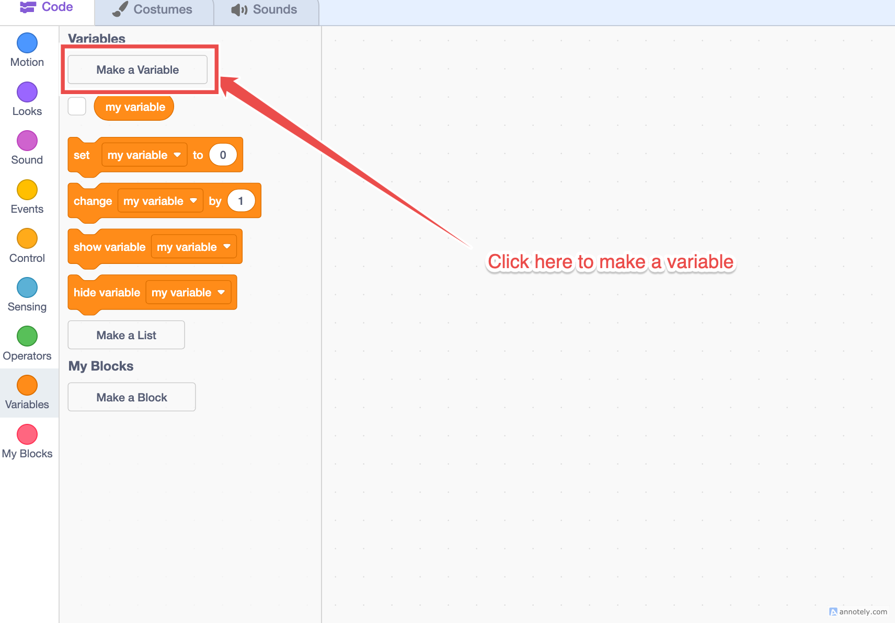

# Coin collector game

For our first program we will make a game in Scratch where your character collects coins to earn points and dodges enemies to avoid losing health. 

!!! note "Stuck? Try this first"
    Getting stuck is part of coding. Before you raise your hand, run through these:

    1. Re-read the section and check its extra resources.
    2. Compare notes with a classmate near you.
    3. Try to name the exact part that isn't working (Example: "my clone won't show" instead of "I don't understand").
    4. Not sure what a block does? Look it up in the [Scratch block list](https://en.scratch-wiki.info/wiki/Blocks#List_of_Blocks).

    Then raise your hand. Knowing what to ask is half of solving it.

<!-- Parts 1 to 9 for the Coin Collector game.
Syntax rules for this site's renderer:
- menus inside a boolean < > use round parens, e.g. < touching (Sprite1 v)? >
- always put a space inside the angle brackets: < ... >
- command menus stay square, e.g. go to [random position v]
- no trailing "end" on the last line of a block
Swap "Sprite1" for your player sprite's real name. -->

Before you start, make two variables from the Variables category: **score** and **Lives**. In any block that says `Sprite1`, use the name of your player sprite instead.

---

## Part 1: Moving to the right

The `forever` loop keeps checking the key, so the cat keeps moving while you hold it.

<pre class="blocks">
when green flag clicked
forever
if < key (right arrow v) pressed? > then
change x by (10)
end
</pre>

!!! check "Does it work?"
    The cat slides right while you hold the right arrow. If not, make sure `change x by` is inside the `if`, and the `if` is inside `forever`.

---

## Part 2: Moving left and right

**x** is the left and right position. A negative number moves left, a positive number moves right.

<pre class="blocks">
when green flag clicked
forever
if < key (right arrow v) pressed? > then
change x by (10)
end
if < key (left arrow v) pressed? > then
change x by (-10)
end
</pre>

!!! check "Does it work?"
    The cat moves both ways. If left does nothing, check that the left key uses `change x by (-10)`.

---

## Part 3: Moving in all four directions

If **x** is left and right, then **y** is up and down. Same pattern, two more keys.

<pre class="blocks">
when green flag clicked
forever
if < key (right arrow v) pressed? > then
change x by (10)
end
if < key (left arrow v) pressed? > then
change x by (-10)
end
if < key (up arrow v) pressed? > then
change y by (10)
end
if < key (down arrow v) pressed? > then
change y by (-10)
end
</pre>

!!! check "Does it work?"
    All four arrows move the cat. If one direction fails, remember x is left and right, y is up and down.

---

## Part 4: Make clones of the enemy

A clone is a temporary copy of a sprite. This stamps a new enemy every 2 seconds. Build both scripts below on your **enemy** sprite.

The code below creates a clone of your enemy every 2 seconds:

<pre class="blocks">
when green flag clicked
forever
create clone of [myself v]
wait (2) seconds
</pre>

The code below makes every clone teleport to a random position when it is created:

<pre class="blocks">
when I start as a clone
show
go to [random position v]
</pre>

!!! check "Does it work?"
    New enemies keep appearing around the stage. If you see none, make sure the clone script has `show`, because clones start hidden.

---

## Part 5: Make the clones follow you

`point towards` sits inside `forever`, so the enemy re-aims at you every loop. That is what makes it chase.

<pre class="blocks">
when I start as a clone
show
go to [random position v]
forever
point towards [Sprite1 v]
move (4) steps
</pre>

!!! check "Does it work?"
    Every enemy turns and moves toward you. If they sit still, check that `point towards` is inside the `forever` loop.

---

## Part 6: Make the enemies appear every 0.5 seconds

The `wait` block is the dial for how fast enemies spawn. Turn it down to flood the screen.

<pre class="blocks">
when green flag clicked
forever
create clone of [myself v]
wait (0.5) seconds
</pre>

!!! check "Does it work?"
    Enemies now pour in quickly. If the pace did not change, make sure you edited the `wait` block instead of adding a second one.

---

## Part 7: Make the score system

Coins use the same clone trick. `score` resets to 0 so a new game starts fresh. Build both scripts on your **coin** sprite.

The coin spawner:

<pre class="blocks">
when green flag clicked
set [score v] to (0)
forever
create clone of [myself v]
wait (1) seconds
</pre>

What each coin does:

<pre class="blocks">
when I start as a clone
show
go to [random position v]
forever
if < touching (Sprite1 v)? > then
change [score v] by (1)
delete this clone
end
</pre>

!!! check "Does it work?"
    Score goes up by 1 each time you touch a coin. If it does not, check the coin is `touching` your player sprite's name.

---

## Part 8: Make a health system

Set **Lives** to 10 at the start, then let each enemy take 5 on contact. This adds one `if` to your chase script.

Start your Lives:

<pre class="blocks">
when green flag clicked
set [Lives v] to (10)
</pre>

The chase, now with a bite:

<pre class="blocks">
when I start as a clone
show
go to [random position v]
forever
point towards [Sprite1 v]
move (4) steps
if < touching (Sprite1 v)? > then
change [Lives v] by (-5)
delete this clone
end
</pre>

!!! check "Does it work?"
    Lives drop by 5 each time an enemy reaches you. If Lives never change, make sure you set Lives to 10 at the start.

---

## Part 9: Make a game over screen

Make a sprite with the words **Game Over** on it. It hides all game, then shows the instant Lives run out. `stop all` freezes the whole project.

<pre class="blocks">
when green flag clicked
hide
forever
if < (Lives) < (1) > then
show
stop [all v]
end
</pre>

!!! check "Does it work?"
    The Game Over sign appears at 0 Lives and the game freezes. If it shows at the start, make sure the sprite `hide`s first.

---

## Assignments

Finish these once your game is working. Each one builds on the part it names.

1. **Part 1:** Make the cat move right twice as fast.
2. **Part 2:** Make the cat move left slower than it moves right.
3. **Part 3:** Make the cat move with w, a, s, d as well: up with w, down with s, left with a, right with d.
4. **Part 4:** Hide the original enemy so only the clones show.
5. **Part 5:** Slow the chase down so the enemies move at 2 steps.
6. **Part 6:** Find the wait time for enemies to appear that feels fair to play, then set it there.
7. **Part 7:** Add a golden coin that is worth 5 points.
8. **Part 8:** Make touching a coin heal 1 life.
9. **Part 9:** Add a You Win screen when the score reaches 20.